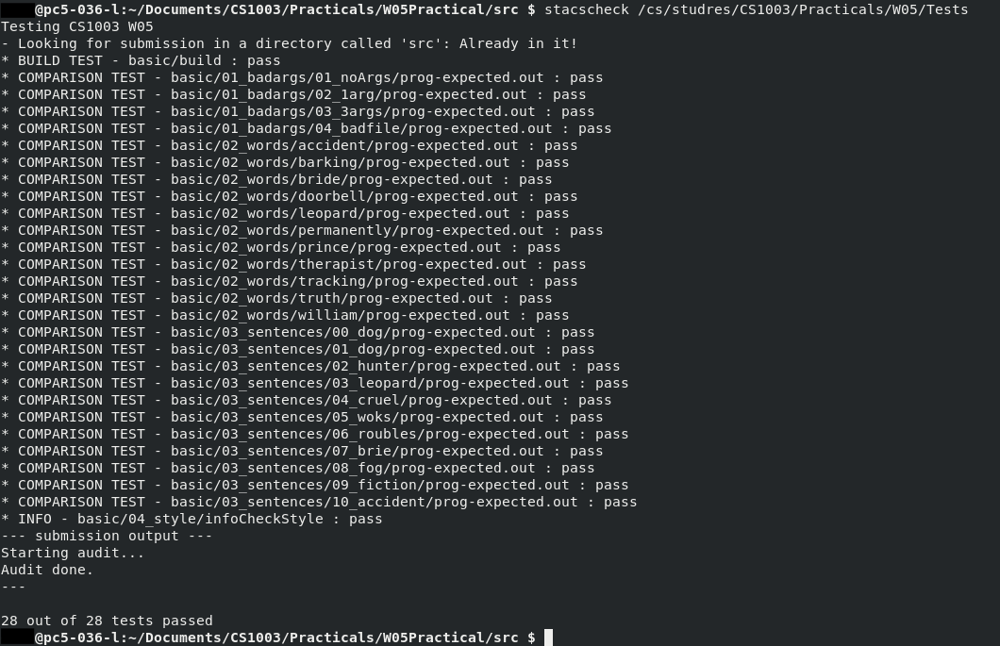

# W05 Practical

## Overview

### Initial Practical

The specification required that a program which takes in two arguments.

* `Argument 1`: The location of the diction of words.
* `Arguments 2`: A string of text

The program then removes 1 consonant from each word in the string of text and checks that that string of that had the consonant removed is contained in the dictionary of words and if it is then it adds it to the list of alternatives for that word. The program then outputs all the alternatives for the words to the 

#### Problem Decomposition

* Read the dictionary file
* Make the the dictionary of words into a set in which comparisons can be made to.
* Read the text.
* Find consonants in the text.
* Delete consonants and compare that word to words in the dictionary.
* It has also been noted words in the dictionary vary in capitalisation so for valid comparison words in the dictionary and string will never to be lowercase before comparison.

### Extension 1: Introduction of same process for vowels

The extension asks that a second version of the program be produced which lists lost vowel alternatives.

#### Assumptions

* second version indicates it has alternative functionality to the original so this is not an additive incremental addition of functionality but alteration of a new program to do the exact same process for vowels.

## Design


### Parser

A two class implementation was decided to fulfil the requirements of the practical. To increase code readability the functionality in which the program requires that implemented in the Parser. The general features in which the program required were abstracted into functions. Then these functions could then be called in the main class. This made the program more readable as the functionality currently occurring could be deduced from name of function and parameters.

It was decided to made the dictionary into a `HashSet` as:

*  elements in the dictionary will be unique.
* the order of the elements in dictionary doesn't matter.

it was also decided to store list of alternatives that need printing in an `ArrayList` instead of directly printing them when they are found. This is because I could the get the length of the `ArrayList` at the end on finding Consonants is ran to determine how many alternatives were found.

### Extension: vowel implementation

The `isConsonant` method replaced with a `isVowel` method which then returned true is a vowel was found.

## Testing

### Test Case 1: Incorrect Arguments supplied

Here it is tested that the program properly reacts to the incorrect number of arguments supplied

##### Expected Output

It is expected that the program outputs an error message along with the number of arguments supplied.

##### Actual Output


#### Test Case 2: Incorrect file Path

Here is it is test that the program correctly reacts to when a file which does not exist is made into dictionary for the program.

##### Expected Output

It is expected that the program outputs an error message along with incorrect path that was let in

##### Actual Output


#### Test Case 3: Correct Functionality Achieved

Here it is tested the program gives the correct output given valid data.

##### Expected Output

I made a new file containing the 5  possible variations of words produced when consonants are removed and one which should never be found since it not produced when consonant is removed.

1. Expect all 6 alternatives since the word `apple chair` has been entered. 
2. No alternatives should be found as none of these variations exist in `nope`.
3. Expect all 6 alternatives since the program cares not about punctuation and capitalisation.
4. Expected 3 alternatives as `aple` can be produce for removal of either p and `appe` from the removal of an L.

##### Actual Output


### Stacscheck Output



## Evaluation

The specification required that a program which would take in two command line arguments:

1. The location of the dictionary file. If the file was unable to found then an error message would be produced.  Through testing it can be seen that the program is able to produce this output.

   ```markdown
   File not found: [fileName] (No such file or directory)
   Invalid dictionary, aborting.
   ```

2. The string being processed.

If these arguments are not received that an appropriate error message be produced and sent to the user. 

1. As can be seen from testing when no arguments or a greater amount that are required are entered the error message. Through testing it was able to be seen that the program is able to produce this error message.

   ```markdown
   Expected 2 command line arguments, but got [args.length].
   Please provide the path to the dictionary file as the first argument and a sentence as the second argument.
   ```

As can be seen from testing the program is able to successfully delete all the constants in the string of input produced and delete them and then determine if an alternative for that word exists in the dictionary of words and also then output the number and all these alternatives to the terminal.

## Conclusion

In this practical a program which was able to delete consonants and compare them to words in the dictionary was produced. 

### Difficulties

* It was found when a word was compared to those in the dictionary some would not compare even though they were present in the dictionary. This was found to be cause by the capitalisation of the words in the dictionary and the capitalisation of the input. So before comparison both were made lowercase to allow all the words which exists in the dictionary to be found.

* It was found when a words which were followed with punctuation were compared to those in the dictionary some would not be found to be in the dictionary. So to fix this error all punctuation had to be removed before the comparison.

### Given More Time